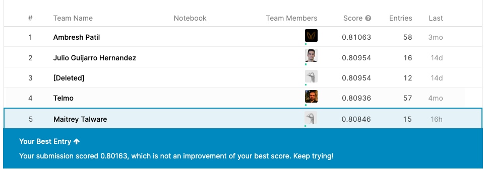

# Arvato Bertelsmann Customer Segmentation Capstone
 
**NOTE:** Part2 and Part 3 are dependent on Clean.py which is not uploaded

## Medium Link :
 https://medium.com/@mt3915/customer-segmentation-for-arvato-bertelsmann-b0026efbb554

### Table of contents

<div class="alert alert-block alert-info" style="margin-top: 20px">
    <ol>
        <li><a href="#ref1">Problem Statement </a></li>
        <li><a href="#ref1">Introduction </a></li>
        <li><a href="#ref1">Code Structure</a></li>
        <li><a href="#ref1">Project Components</a></li>
                <ul>
         <li><a href="#ref3">Part 0: Get to Know the Data</a></li>
        <li><a href="#ref4">Part 1: Customer Segmentation Report</a></li>
        <li><a href="#ref4">Part 2: Supervised Learning Model</a></li>
        <li><a href="#ref4">Part 3: Kaggle Competition</a></li>
        </ul>
        <li><a href="#ref2">Improvements</a></li>
        <li><a href="#ref9">Conclusion section</a></li>
        <li><a href="#ref9">References</a></li>
    </ol>
</div>

## 1. Problem Statement
This challenge, which was also a real-life project, is provided by Arvato Financial Solutions. 

The problem statement is:
- How can their client, a mail-order company, acquire new clients more efficiently?

## 2. Introduction
Customer segmentation is a method of analysing a client base and grouping customers into categories or segments which share particular attributes. Key differentials in segmentation inc
lude age, gender, education, location, spending patterns and socio-economic group. Relevant differentials are those which are expected to influence customer behaviour in relation to a business. The selected criteria are used to create customer segments with similar values, needs and wants.

When planning a targeted marketing campaign, it is also necessary to differentiate customers within these groupings according to their preferred means of communication.

<a href='https://newgrove.com/an-introduction-to-customer-segmentation/
'>Defintion referenced from Newgrove</a>

## 3. Code Structure
```
.
├── Images
│   ├── Rank1.png
│   └── Rank.png
├── Part 0-Get to Know the Data.ipynb.ipynb---------# GET TO KNOW THE DATA
├── Part 1- Customer Segmentation Report.ipynb -----# UNSUPERVISED LEARNING
├── Part 2 and Part 3.ipynb --------# SUPERVISED LEARNING AND KAGGLE SUBMISSION
├── Clean.py-------------------------# CONTAINS FINAL CLEANING AND MODEL LOGIC (NOT UPLOADED)
├── reg_model.sav-------------------------# SUPERVISED LEARNING MODEL
├── model_k.sav-------------------------# K-MEANS MODEL
├── Readme.md-------------------------# README FILE

```

## 4. Project Components

### 1. Part 0: Get to Know the Data
- Importing Data
- Exploratory Data Analysis
    - Descriptive Statistics
    - Missing Values
- Data Preprocessing
    - Data Consistency
    - Data Uniformity
    - Handling Missing Values
    - One hot Encoding categorical data
    - Standardizing the dataset
- Code Refactoring of all the above data cleaning steps

### 2. Part 1: Customer Segmentation Report

- Importing data cleaning refactored  function
- Dimensionality Reduction using PCA
- K- means for customer segmentation
- Analysis

### 3. Part 2: Supervised Learning Model
- Importing Training data
- Preprocessing using data cleaning code
- Feature generation using K-means model
- Split Training dataset into Train-Validation splits
- Training the Model
- Testing on validation set

### Part 3: Kaggle Competition
- Importing the Testing data
- Preprocessing using data cleaning code
- Feature generation using K-means model
- Predict using the model
- Submit predictions to kaggle

## 5. Improvements
In order to increase the performance of the supervised learning model, the following parts might be conducted.
- The methods that deal with unbalanced data: under-sampling or over- sampling.
- Increase PCA components.


## 6. Conclusion section
The trained model was able to get a score of 0.80846 on the testing dataset which placed it in **Rank : 5** of the standings. It can still be improved by feature engineering but it requires specific domain knowledge on the datasets.

### Kaggle Competition Rank 5



## 7. References

- Udacity
- GridSearchCV
- scikit-learn
- Many other open sources